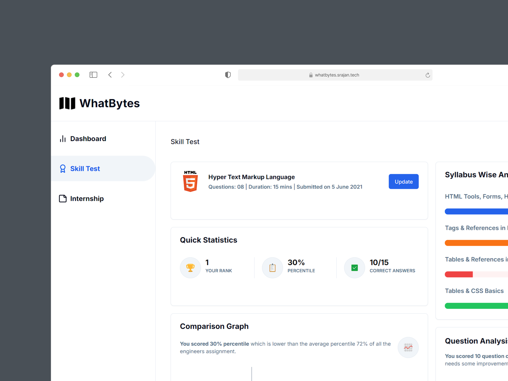

# WhatBytes Assignment

<div align="center">
  
</div>

## Installation

To run this project locally, follow these steps:

1. Clone the repository:

   ```bash
   git clone https://github.com/srajankumar/whatbytes-assignment.git
   ```

2. Navigate to the project directory:

   ```bash
   cd whatbytes-assignment
   ```

3. Install the dependencies:

   ```bash
   npm install
   ```

4. Start the development server:

   ```bash
   npm run dev
   ```

5. Open your browser and visit `http://localhost:3000` to view the app.

## Contact

Feel free to reach out if you have any questions or feedback on my project - [srajan.tech](https://srajan.tech)

> _Thank you for taking the time to review my assignment. I look forward to hearing back from you soon :)_
